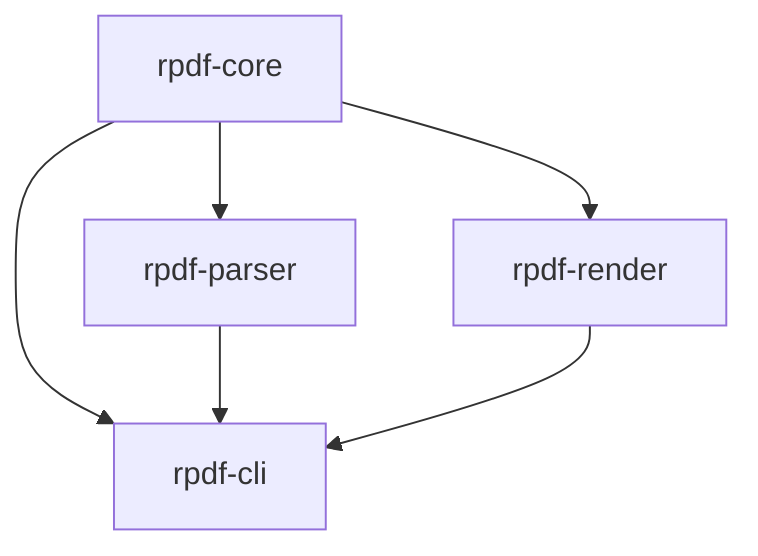

# 크레이트 의존성 맵 (Dependency Map)

"X를 바꾸면 어디가 영향을 받는가?" 에 답하기 위한 문서.

## 크레이트 의존 그래프



| 크레이트 | 의존 대상 | 의존 받는 대상 |
|----------|-----------|----------------|
| `rpdf-core` | 없음 | rpdf-parser, rpdf-render, rpdf-cli |
| `rpdf-parser` | rpdf-core | rpdf-cli |
| `rpdf-render` | rpdf-core, pdfium(런타임) | rpdf-cli |
| `rpdf-cli` | rpdf-core, rpdf-parser, rpdf-render | 없음 (바이너리) |

## 변경 영향 범위

### `rpdf-core` 타입 변경 시

전체 크레이트 재컴파일. 영향 범위:

```
rpdf-core 변경
 → rpdf-parser 재컴파일 (Document IR 사용)
 → rpdf-render 재컴파일 (Page, ObjRef 사용)
 → rpdf-cli 재컴파일 (모든 타입 사용)
```

**주의 (Caveat)**: `rpdf-core` 타입은 `Copy + Clone + PartialEq + Eq` 불변식 — 이를 깨면 모든 크레이트에서 컴파일 오류.

### `rpdf-parser` 내부 변경 시

`rpdf-cli`만 재컴파일. `rpdf-render`는 영향 없음.

### `rpdf-render` 내부 변경 시

`rpdf-cli`만 재컴파일. `rpdf-parser`는 영향 없음.

## 외부 의존성

| 크레이트 | 외부 의존 | 특이사항 |
|----------|-----------|----------|
| `rpdf-render` | pdfium 동적 라이브러리 | 런타임 로딩, `PDFIUM_DYNAMIC_LIB_PATH` 환경변수 필요 |
| `rpdf-cli` | clap (CLI 파싱) | 컴파일 타임 의존 |
| `rpdf-parser` | 없음 (직접 구현) | lopdf 미사용 결정 → ADR-003 참고 |

## 관련 (See Also)

- [crates/CLAUDE.md](../crates/CLAUDE.md) — 크레이트 역할·규칙
- [docs/decisions/ADR-001-crate-workspace-structure.md](decisions/ADR-001-crate-workspace-structure.md) — 크레이트 분리 결정
- [mydocs/manual/architecture.md](../mydocs/manual/architecture.md) — 전체 아키텍처 개요
